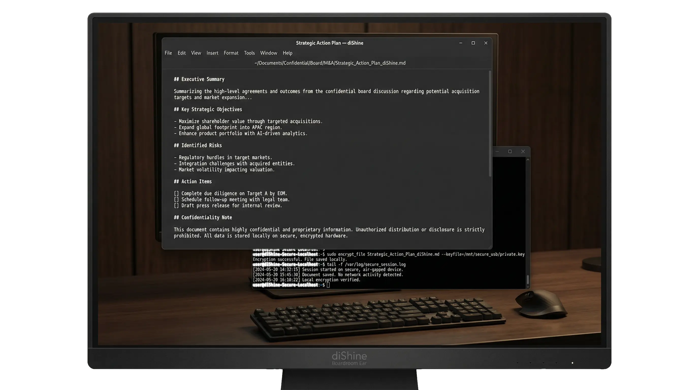
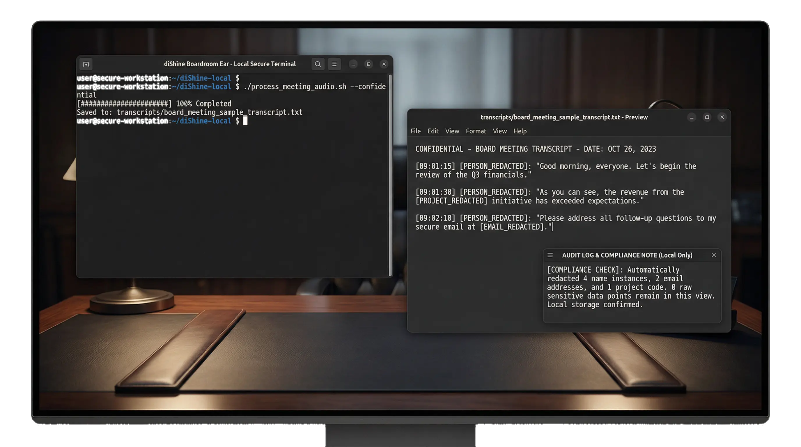

# 🛠️ Boardroom Ear: NDA-compliant local transcriber & strategic analyst for confidential Boardrooms.

<div align="center">
  
[](https://dishine.it/)

***Transform. Automate. Shine!***

[](https://dishine.it/)
[](https://linkedin.com/company/100682596)
[]()
[](LICENSE)

<p align="center">
  
</p>

*Board meetings, M&A discussions, and legal strategies are too sensitive for cloud recording bots. `diShine Boardroom Ear` is a portable, security-first intelligence tool that runs 100% locally on your MacBook. It transforms raw audio into structured strategic assets without a single byte leaving your device.*

Built by [diShine Digital Agency](https://dishine.it). 

</div>

<p align="center">
  
  
</p>

<p align="center">
  
</p>

---

## Why this exists

Standard tools like Otter.ai or Fireflies are convenient, but they represent a real liability in highly confidential environments. `Boardroom Ear` was built to deliver the power of AI transcription and strategic analysis while maintaining a **Zero Trust** relationship with the cloud.

It is specifically designed for:
- **Board of Directors**: Capturing strategic intent without risking data leaks.
- **M&A Advisors**: Analysing deal rooms and negotiation sessions locally.
- **Legal Strategy**: Transcribing depositions or strategy sessions with absolute privacy.
- **Consultants**: Delivering high-value summaries directly on-site from a USB or local drive.

---

## What's included

| Component | Engine | What it provides |
|-----------|--------|-----------------|
| **Local Transcriber** | `faster-whisper` | 100% offline audio-to-text with INT8 quantisation. |
| **NDA Scrubber** | Regex + pattern library | Automatic redaction of names, emails, phones, IPs, URLs, dates, and entities. |
| **Strategic Planner** | `Claude-3.5-Sonnet` | Professional action plans and executive summaries (opt-in, anonymised input only). |
| **Edge Intelligence** | Metal/MPS | Optimised for Apple Silicon (M1-M4) performance. |

---

### Documentation

| Document | Contents |
|----------|----------|
| [INSTALLATION.md](INSTALLATION.md) | Step-by-step setup for macOS and Linux |
| [USAGE.md](USAGE.md) | CLI reference, workflow examples, configuration guide |
| [TROUBLESHOOTING.md](TROUBLESHOOTING.md) | Common issues and solutions |
| [API.md](API.md) | Python API reference for developers |
| [SECURITY.md](SECURITY.md) | NDA compliance details, privacy guarantees, audit trails |
| [CHANGELOG.md](CHANGELOG.md) | Version history and release notes |

For a complete guide, refer to [GUIDE.md](GUIDE.md)

---

## Platform support

| Platform | Local Transcription | Strategic AI | Privacy Level |
|----------|---------------------|--------------|---------------|
| macOS (M1-M4) | Full (Metal/MPS) | Optional | 100% NDA-Compliant |
| macOS (Intel) | Full (CPU) | Optional | 100% NDA-Compliant |
| Linux (x64) | Full (CPU/CUDA) | Optional | 100% NDA-Compliant |


## Getting started

### 1. One-time setup

```bash
git clone https://github.com/diShine-digital-agency/dishine-boardroom-ear.git
cd dishine-boardroom-ear
chmod +x setup.sh
./setup.sh
```

See [INSTALLATION.md](INSTALLATION.md) for platform-specific instructions (macOS Apple Silicon, Intel, Linux).

### 2. Operational workflow

1. Drop your `.mp3`, `.wav`, or `.m4a` file into `drop_here/`.
2. Double-click `Boardroom_Ear.command` — or run:
   ```bash
   python3 Boardroom_Ear.py
   ```
3. Find your transcript and optional Strategic Plan in `transcripts/`.

### 3. Common CLI examples

```bash
# Process a specific file, skip the AI plan
python3 Boardroom_Ear.py --input meeting.mp3 --no-plan

# Batch-process a folder with full anonymisation
python3 Boardroom_Ear.py --batch --input-dir recordings/ --anonymization full

# Use the large model for maximum accuracy
python3 Boardroom_Ear.py --model large-v3

# Validate setup without transcribing
python3 Boardroom_Ear.py --health-check
```

See [USAGE.md](USAGE.md) for the full CLI reference and configuration guide.

---

## Directory structure

```text
dishine-boardroom-ear/
├── Boardroom_Ear.py        # Main entry point (CLI + orchestrator)
├── Boardroom_Ear.command   # One-click launcher for macOS
├── config.yaml             # Model, device, and output settings
├── logging.yaml            # Logging configuration
├── setup.sh                # Dependency installer
├── requirements.txt        # Pinned Python dependencies
├── requirements-dev.txt    # Dev/test dependencies
├── .env.example            # Environment variable template
├── core/                   # Whisper engine wrapper
│   ├── __init__.py
│   └── boardroom_ear.py
├── analysis/               # Scrubber and Strategic Planner
│   ├── __init__.py
│   ├── scrubber.py
│   └── strategic_planner.py
├── tests/                  # Unit tests
│   ├── test_scrubber.py
│   └── sample_config.yaml
├── drop_here/              # Place audio files here (gitignored)
└── transcripts/            # Output folder (gitignored)
```
---

## Security & NDA compliance

The tool follows a local-first architecture:

1. **Raw audio**: Stays on local disk. Never uploaded.
2. **Transcription**: Runs in local memory via CTranslate2.
3. **Anonymisation**: The PII scrubber replaces personal data with tokens (e.g. `[PERSON_REDACTED]`) before any external call. Supports `token`, `blank`, and `hash` redaction modes.
4. **Cloud opt-in**: Strategic analysis via Anthropic is strictly opt-in and uses only the anonymised text.
5. **Audit trail**: Redaction counts (not raw text) are logged to `transcripts/audit.log` for compliance reviews.

See [SECURITY.md](SECURITY.md) for full details.

---

## How it compares

Most transcription tools fall into two camps: cloud services that are easy to use but upload your data, and open-source local tools that keep data private but stop at raw text. Boardroom Ear sits in between — fully local transcription with built-in PII scrubbing and an optional (anonymised-only) strategic analysis layer.

| Capability | **Boardroom Ear** | Otter.ai | Fireflies.ai | whisper.cpp | MacWhisper |
|---|---|---|---|---|---|
| Runs 100 % locally | Yes | No — cloud | No — cloud | Yes | Yes |
| PII / NDA scrubber | Built-in (regex, 7 entity types, 3 redaction modes, audit log) | No | No | No | No |
| Strategic action plans | Yes — Claude API, anonymised input only, opt-in | Built-in summaries | Built-in summaries | No | No |
| Speaker diarisation | Not yet | Yes | Yes | Not built-in | Yes |
| Real-time / live capture | Not yet (file-based) | Yes | Yes | Possible with wrapper | Yes |
| GUI | CLI + one-click macOS launcher | Web + mobile app | Web app | CLI | macOS app |
| Apple Silicon optimised | Yes (Metal / MPS) | N/A (cloud) | N/A (cloud) | Yes (Metal) | Yes (Metal) |
| Audit trail | Yes (redaction counts only, no raw text) | No | No | No | No |
| Air-gapped operation | Yes (`--no-plan` + cached model) | No | No | Yes | Partial |
| Price | Free / open source | Paid subscription | Paid subscription | Free / open source | Paid (one-time) |

**In short:** If your recordings can go to the cloud, Otter or Fireflies provide a more polished experience with live capture and speaker labels. If they cannot — because of NDAs, legal obligations, or policy — Boardroom Ear is the only tool that combines local transcription, automatic PII redaction, and optional AI-generated action plans in a single pipeline.

---

## Running tests

```bash
pip install -r requirements-dev.txt
pytest tests/ -v
```
