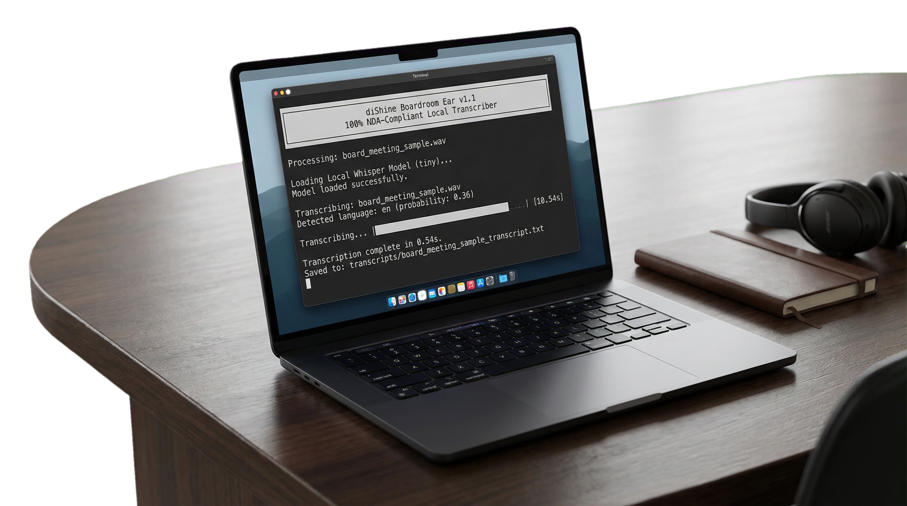
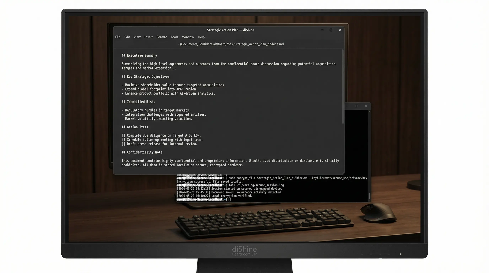
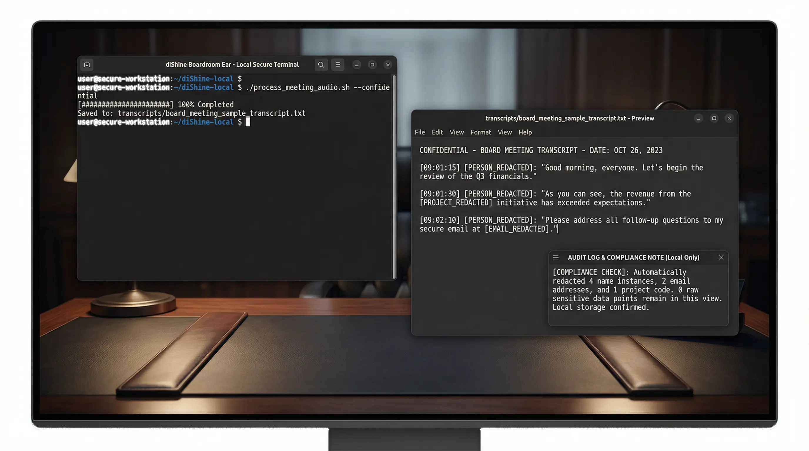
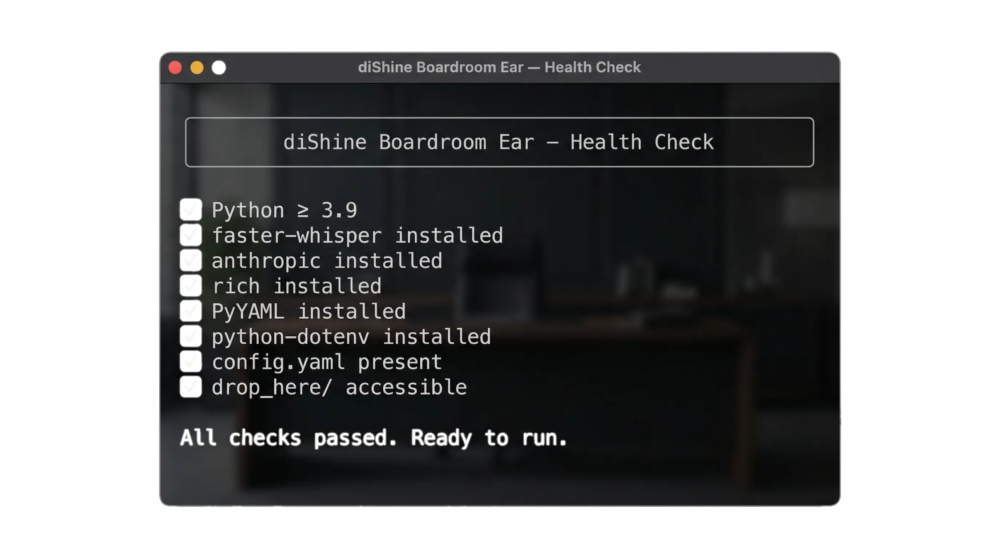

# Boardroom Ear, the 100% NDA-compliant local transcriber & strategic analyst for confidential Boardrooms.

<p align="center">
  
</p>

Board meetings, M&A discussions, and legal strategies are too sensitive for cloud recording bots. `diShine Boardroom Ear` is a portable, security-first intelligence tool that runs 100% locally on your MacBook. It transforms raw audio into structured strategic assets without a single byte leaving your device.

<p align="center">
  
  
</p>

<p align="center">
  
</p>

Built by [diShine](https://dishine.it) | Kevin Escoda.

---

## Why this exists

Standard tools like Otter.ai or Fireflies are convenient, but they represent a massive liability in highly confidential environments. `Boardroom Ear` was built to provide the power of AI transcription and strategic analysis while maintaining a **Zero Trust** relationship with the cloud.
Standard tools like Otter.ai or Fireflies are convenient, but they represent a real liability in highly confidential environments. `Boardroom Ear` was built to deliver the power of AI transcription and strategic analysis while maintaining a **Zero Trust** relationship with the cloud.

It’s specifically designed for:
It is specifically designed for:
- **Board of Directors**: Capturing strategic intent without risking data leaks.
- **M&A Advisors**: Analyzing deal rooms and negotiation sessions locally.
- **M&A Advisors**: Analysing deal rooms and negotiation sessions locally.
- **Legal Strategy**: Transcribing depositions or strategy sessions with absolute privacy.
- **Consultants**: Providing high-value summaries directly on-site from a USB or local drive.
- **Consultants**: Delivering high-value summaries directly on-site from a USB or local drive.

---

## What's included

| Component | Logic | What it provides |
|-----------|-------|------------------|
| **Local Transcriber** | `faster-whisper` | 100% offline audio-to-text with INT8 quantization. |
| **NDA Scrubber** | `PII-Scrubber` | Automatic redaction of names, emails, and entities. |
| **Strategic Planner** | `Claude-3.5-Sonnet` | Professional action plans and executive summaries. |
| **Edge Intelligence** | `Metal/MPS` | Optimized for Apple Silicon (M1/M2/M3/M4) performance. |
| Component | Engine | What it provides |
|-----------|--------|-----------------|
| **Local Transcriber** | `faster-whisper` | 100% offline audio-to-text with INT8 quantisation. |
| **NDA Scrubber** | Regex + pattern library | Automatic redaction of names, emails, phones, IPs, URLs, dates, and entities. |
| **Strategic Planner** | `Claude-3.5-Sonnet` | Professional action plans and executive summaries (opt-in, anonymised input only). |
| **Edge Intelligence** | Metal/MPS | Optimised for Apple Silicon (M1-M4) performance. |

---

## Platform Support
### Documentation

| Document | Contents |
|----------|----------|
| [INSTALLATION.md](INSTALLATION.md) | Step-by-step setup for macOS and Linux |
| [USAGE.md](USAGE.md) | CLI reference, workflow examples, configuration guide |
| [TROUBLESHOOTING.md](TROUBLESHOOTING.md) | Common issues and solutions |
| [API.md](API.md) | Python API reference for developers |
| [SECURITY.md](SECURITY.md) | NDA compliance details, privacy guarantees, audit trails |
| [CHANGELOG.md](CHANGELOG.md) | Version history and release notes |

For a complete guide, reffer to [GUIDE.md](GUIDE.md)

---

## Platform support

| Platform | Local Transcription | Strategic AI | Privacy Level |
|----------|---------------------|--------------|---------------|
| macOS (M1-M4) | Full (Metal) | Optional | 100% NDA-Complient |
| macOS (Intel) | Full (CPU) | Optional | 100% NDA-Complient |
| Linux (x64) | Full (CPU) | Optional | 100% NDA-Complient |
| macOS (M1-M4) | Full (Metal/MPS) | Optional | 100% NDA-Compliant |
| macOS (Intel) | Full (CPU) | Optional | 100% NDA-Compliant |
| Linux (x64) | Full (CPU/CUDA) | Optional | 100% NDA-Compliant |


## Getting started

### 1. Preparation (One-time setup)
Ensure you have Python 3.9+ and FFmpeg. Then run the installer:
### 1. One-time setup

```bash
git clone https://github.com/diShine-digital-agency/dishine-boardroom-ear.git
cd dishine-boardroom-ear
chmod +x setup.sh
./setup.sh
```

### 2. Operational Workflow
1. Drop your `.mp3` or `.m4a` files into the `drop_here/` folder.
2. Double-click `Boardroom_Ear.command` (or run `python3 Boardroom_Ear.py`).
3. Transcripts and Strategic Plans will be generated in `transcripts/`.
See [INSTALLATION.md](INSTALLATION.md) for platform-specific instructions (macOS Apple Silicon, Intel, Linux).

### 2. Operational workflow

1. Drop your `.mp3`, `.wav`, or `.m4a` file into `drop_here/`.
2. Double-click `Boardroom_Ear.command` — or run:
   ```bash
   python3 Boardroom_Ear.py
   ```
3. Find your transcript and optional Strategic Plan in `transcripts/`.

### 3. Common CLI examples

```bash
# Process a specific file, skip the AI plan
python3 Boardroom_Ear.py --input meeting.mp3 --no-plan

# Batch-process a folder with full anonymisation
python3 Boardroom_Ear.py --batch --input-dir recordings/ --anonymization full

# Use the large model for maximum accuracy
python3 Boardroom_Ear.py --model large-v3

# Validate setup without transcribing
python3 Boardroom_Ear.py --health-check
```

See [USAGE.md](USAGE.md) for the full CLI reference and configuration guide.

---

## Directory Structure
## Directory structure

```text
dishine-boardroom-ear/
├── Boardroom_Ear.command  # Quick-launch script for Mac
├── Boardroom_Ear.py       # Core application hub
├── config.yaml            # Model settings and API credentials
├── setup.sh               # Dependency installer
├── core/                  # Optimized Whisper engine wrappers
├── analysis/              # Scrubber and Strategic Planner modules
├── drop_here/             # Place audio files here
└── transcripts/           # Output folder (Transcripts + MD Reports)
├── Boardroom_Ear.py        # Main entry point (CLI + orchestrator)
├── Boardroom_Ear.command   # One-click launcher for macOS
├── config.yaml             # Model, device, and output settings
├── logging.yaml            # Logging configuration
├── setup.sh                # Dependency installer
├── requirements.txt        # Pinned Python dependencies
├── requirements-dev.txt    # Dev/test dependencies
├── .env.example            # Environment variable template
├── core/                   # Whisper engine wrapper
│   ├── __init__.py
│   └── boardroom_ear.py
├── analysis/               # Scrubber and Strategic Planner
│   ├── __init__.py
│   ├── scrubber.py
│   └── strategic_planner.py
├── tests/                  # Unit tests
│   ├── test_scrubber.py
│   └── sample_config.yaml
├── drop_here/              # Place audio files here (gitignored)
└── transcripts/            # Output folder (gitignored)
```
---

## Security & NDA Compliance
## Security & NDA compliance

The tool follows a local-first architecture:

1. **Raw audio**: Stays on local disk. Never uploaded.
2. **Transcription**: Runs in local memory via CTranslate2.
3. **Anonymisation**: The PII scrubber replaces personal data with tokens (e.g. `[PERSON_REDACTED]`) before any external call. Supports `token`, `blank`, and `hash` redaction modes.
4. **Cloud opt-in**: Strategic analysis via Anthropic is strictly opt-in and uses only the anonymised text.
5. **Audit trail**: Redaction counts (not raw text) are logged to `transcripts/audit.log` for compliance reviews.

See [SECURITY.md](SECURITY.md) for full details.

The tool follows a "Local-First" architecture:
1. **Raw Audio Storage**: Stays on the local drive. Never uploaded.
2. **Transcription**: Happens in local memory using CTranslate2.
3. **Anonymization**: A regex-based scrubber replaces PII with tokens (e.g., `[PERSON_REDACTED]`) before any external analysis.
4. **Cloud Opt-in**: Strategic analysis via Anthropic is strictly opt-in and ONLY uses anonymized text.
---

## Running tests

```bash
pip install -r requirements-dev.txt
pytest tests/ -v
```
